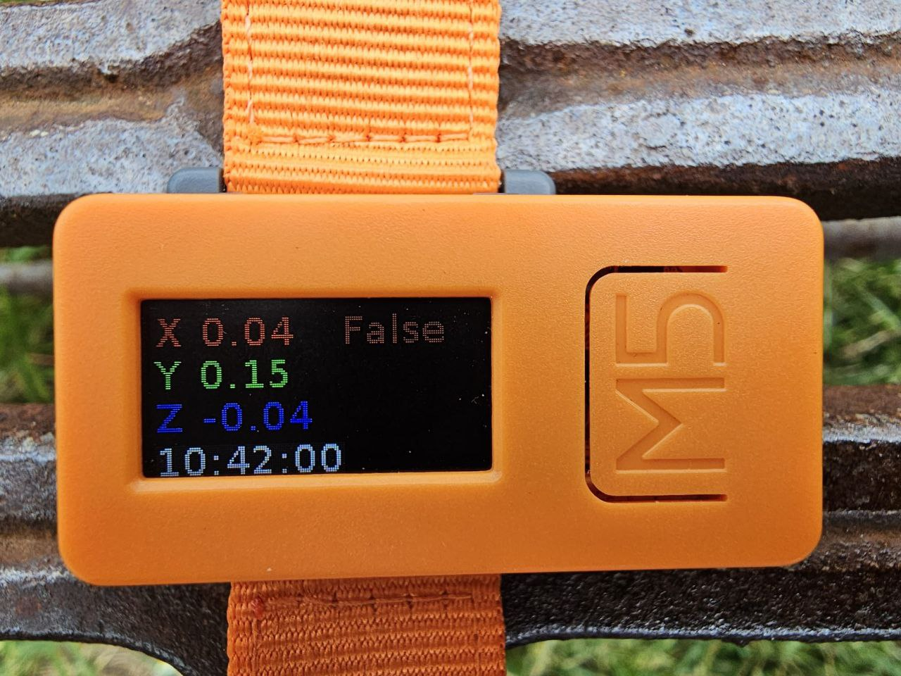

# m5_move-detector
Program written in python to compete in the TELECO GAMES

# Code Explanation

This Python script is used to configure and control an M5StickC device. The M5StickC is an IoT (Internet of Things) device based on ESP32 that has a variety of features, including an LCD screen, an accelerometer, and WiFi connectivity capabilities.

## Imports

The script begins by importing several modules necessary for its operation. These include `M5`, `network`, `umqtt`, `time`, `utime`, `os`, `sys`, `io`, and `machine`.

## Global Variables

Several global variables are defined that will be used throughout the script. These include `etiquetas`, `wlan`, `mqtt_cliente`, and `ultimo_movimiento_tiempo`.

## Functions

The script defines several functions:

- `configurarDisplay()`: Configures the M5StickC's display.
- `conectarWifi()`: Connects the M5StickC to a WiFi network.
- `conectarMQTT()`: Connects the M5StickC to an MQTT server.
- `buclePrincipal()`: Is the main loop of the program that runs continuously.
- `actualizarDisplay()`: Updates the information displayed on the M5StickC's screen.
- `publicarMQTT()`: Publishes messages to an MQTT server.
- `manejarDesconexionWifi()`: Handles cases where the M5StickC disconnects from the WiFi network.
- `manejarExcepcion(excepcion)`: Handles exceptions that may occur during the execution of the script.
- `movimientoDetectado(x, y, z)`: Detects if the M5StickC has moved.
- `avisoLed()`: Controls the M5StickC's LED.

## Script Execution

Finally, if the script is run as the main script (i.e., it is not imported from another script), a pin is configured, the display is set up, it connects to the WiFi network, connects to the MQTT server, and enters the main loop.
